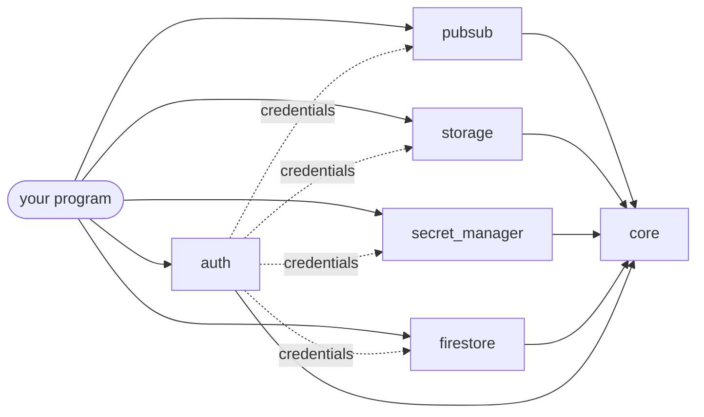

<div align="center">


# zig-gcp

**Google Cloud clients for Zig, written against the REST APIs.**<br>
Pub/Sub, Cloud Storage, Secret Manager and Firestore, with credentials that find themselves.

[](https://github.com/kmoneil/zig-gcp/actions/workflows/ci.yml)
[](https://github.com/kmoneil/zig-gcp/releases)
[](https://ziglang.org/download/)
[](build.zig.zon)
[](LICENSE)

[**Documentation**](docs/README.md) · [Quick start](#quick-start) · [Examples](#examples) · [Changelog](CHANGELOG.md) · [Contributing](CONTRIBUTING.md)

</div>

## Why zig-gcp

- 🪶 **Nothing else to install.** No dependencies beyond the Zig standard
  library. One package, `gcp`, with a module per service: an application
  compiles only the modules it imports.
- 🔐 **Credentials that find themselves.** `auth.findDefault` picks the
  metadata server on Google Cloud, the login gcloud saved, or a file the
  environment names, the way Google's own libraries do, so one binary
  runs on a laptop and on Cloud Run without a flag.
- 🌊 **Objects of any size, in constant memory.** Uploads and downloads
  stream through any reader or writer, split into parallel parts and
  ranges, and pick up where they stopped after a dropped connection, or
  from a checkpoint after the process itself ended.
- ✅ **Checked both ways.** Every transfer is held to the CRC-32C Cloud
  Storage keeps, computed with the CPU's own instructions (29 GiB/s on
  an Apple M5 Max). Secrets are verified, never logged, and wiped when
  released.
- 🔁 **Retries that know what is safe.** Transient failures are retried
  with jittered backoff, and a Cloud Storage write only when its
  preconditions or an idempotency token make a repeat harmless.
- 📏 **Measured against production.** Limits and behavior come from
  measuring Google's services, not only from their documentation. Where
  an emulator takes what production refuses, the client checks first, so
  code tested locally does not fail later.
- 🛡️ **Built for hostile input.** Any response yields a value or an
  error: never a crash, a leak, or a truncated body taken for a whole
  one. Fuzzed every night. See [SECURITY.md](SECURITY.md).

## What's inside

| | Module | Covers | Status |
| :-: | --- | --- | --- |
| 📨 | [`pubsub`](docs/pubsub/README.md) | Pub/Sub v1: publish one call at a time or batched from many tasks; pull, a worker loop that manages leases, and exactly-once delivery; topics, subscriptions and snapshots, with their IAM policies; replaying and purging by seeking, and detaching | beta |
| 🪣 | [`storage`](docs/storage/README.md) | Cloud Storage: objects of any size, streamed, parallel, resumable and checksummed both ways; preconditions, compose and server-side copies; buckets, versions, soft delete, retention and holds, IAM; folders, tree renames and managed folders; access control lists; signed URLs and POST policies, signed by a service account or an HMAC key; HMAC keys; encryption keys; Pub/Sub notifications | experimental |
| 🔥 | [`firestore`](docs/firestore/README.md) | Cloud Firestore: documents read and written under preconditions, commits with field transforms, batched reads, queries and aggregations over collections and collection groups, large answers read one document at a time as they arrive, transactions run again on contention; the default database or a named one | experimental |
| 🔑 | [`secret_manager`](docs/secret-manager/README.md) | Secret Manager v1: a secret's bytes, verified and wiped after use; versions; secrets global or regional, their settings, notifications, rotation, encryption keys and IAM policies | experimental |
| 🪪 | [`auth`](docs/auth.md) | Credentials for the other modules: the metadata server, gcloud's login, service account keys, workload identity federation and impersonation; signing on this machine or through IAM | experimental |
| ⚙️ | [`core`](docs/essentials.md) | What the service modules share: the HTTP transport, retries, `Diagnostics`, CRC-32C at the CPU's speed, IAM policies, the `TokenProvider` and `Signer` seams, and test fakes. Each service re-exports what its callers need. | beta |



The service modules never import one another, or `auth`: credentials
reach them through `core`'s `TokenProvider` seam, so an application
that brings its own tokens needs no `auth` at all.

## Install

Zig **0.17.0** (`minimum_zig_version` enforces it). For Zig 0.16.0, use
v0.30.0, the last release that builds with it.

```sh
zig fetch --save git+https://github.com/kmoneil/zig-gcp#v0.34.0
```

```zig
// build.zig
const gcp = b.dependency("gcp", .{ .target = target, .optimize = optimize });
exe.root_module.addImport("pubsub", gcp.module("pubsub"));
exe.root_module.addImport("auth", gcp.module("auth")); // for credentials
exe.root_module.addImport("secret_manager", gcp.module("secret_manager"));
exe.root_module.addImport("storage", gcp.module("storage"));
exe.root_module.addImport("firestore", gcp.module("firestore"));
```

## Quick start

Find credentials, upload an object, and announce it on a topic:

<!-- snippet: examples/quickstart.zig -->
```zig
const std = @import("std");
const auth = @import("auth");
const pubsub = @import("pubsub");
const storage = @import("storage");

pub fn main(init: std.process.Init) !void {
    // Credentials, found the way Google's own libraries find them: the file
    // GOOGLE_APPLICATION_CREDENTIALS names, gcloud's login, or the metadata
    // server on Google Cloud.
    const lookup = try auth.Lookup.fromEnv(init.environ_map, init.arena.allocator());
    var creds = try auth.findDefault(init.gpa, init.io, lookup, .{});
    defer creds.deinit();

    // An upload that only creates, with a CRC-32C that Cloud Storage
    // checks: a body changed on the way is refused, never stored.
    var gcs = try storage.Client.init(init.gpa, init.io, .{ .token_provider = creds.provider() });
    defer gcs.deinit();
    const report = gcs.bucket("my-bucket").object("reports/q3.txt");
    var stored = try report.upload("hello world\n", .{
        .content_type = "text/plain",
        .preconditions = .does_not_exist,
    });
    defer stored.deinit();

    // A message that names it, for whoever subscribes.
    var ps = try pubsub.Client.init(init.gpa, init.io, .{
        .project_id = "my-project",
        .token_provider = creds.provider(),
    });
    defer ps.deinit();
    var sent = try ps.topic("reports").publish(&.{.{ .data = report.name }}, .{});
    defer sent.deinit();

    std.log.info("stored generation {d}, published message {s}", .{
        stored.value.generation,
        sent.value.message_ids[0],
    });
}
```

For credentials, `gcloud auth application-default login` once on a
laptop is all it needs, and nothing on Google Cloud. Against the
emulators, give each client `.endpoint = Endpoint.fromEnv(init.environ_map)`
and no credentials: [Essentials](docs/essentials.md#endpoints-and-emulators)
says how.

## Documentation

| Guide | What's in it |
| --- | --- |
| 🧭 [Essentials](docs/essentials.md) | Clients and handles, results and memory, errors and `Diagnostics`, retries and time limits, logging, testing with fakes |
| 🪪 [Credentials](docs/auth.md) | Where `findDefault` looks, every kind of credential, quota projects and signing |
| 🔏 [IAM](docs/iam.md) | Granting, revoking and testing permissions on buckets, topics, subscriptions and secrets |
| 📨 [Pub/Sub](docs/pubsub/README.md) | Publishing at volume, a worker loop, exactly-once delivery, subscription settings, IAM, limits |
| 🪣 [Cloud Storage](docs/storage/README.md) | Transfers of any size, checksums and gzip, safe writes, signed URLs, buckets, retention, encryption keys, notifications, folders, ACLs, HMAC keys |
| 🔑 [Secret Manager](docs/secret-manager/README.md) | Reading secrets safely, changing them under an etag, notifications and rotation, regional secrets |
| 🔥 [Firestore](docs/firestore/README.md) | Documents and their values, masks and preconditions, transforms and commits, queries and aggregations, transactions, and where the emulator differs |
| 🛠️ [Development](docs/development.md) | Building, testing, fuzzing, coverage, and every integration suite |

The [documentation index](docs/README.md) lists every page.

## Examples

| Example | What it does | Try it |
| --- | --- | --- |
| [`quickstart`](examples/quickstart.zig) | The quick start above | `zig build example-quickstart` |
| [`publish`](examples/publish.zig) | Publishes messages, creating the topic first if needed | `zig build example-publish -- orders 5` |
| [`publisher`](examples/publisher.zig) | Publishes from several tasks through one `Publisher`, and says how few requests it took | `zig build example-publisher -- orders 1000 4` |
| [`worker`](examples/worker.zig) | Consumes a subscription with `Subscriber`, extending leases while it works | `zig build example-worker -- orders orders-worker` |
| [`whoami`](examples/whoami.zig) | Which credentials this machine offers, and the topics they see | `zig build example-whoami` |
| [`secret`](examples/secret.zig) | Reads a secret and reports which version answered | `zig build example-secret -- db-password latest` |
| [`gcs_cp`](examples/gcs_cp.zig) | Copies files to and from Cloud Storage in constant memory: parallel, resumable, compressed, under keys | `zig build example-gcs_cp -- backup.tar gs://my-bucket/backup.tar` |
| [`gcs_sign`](examples/gcs_sign.zig) | Signs a URL, or prints an HTML form with a POST policy, as a service account or with an HMAC key | `zig build example-gcs_sign -- gs://my-bucket/reports/q3.txt` |
| [`gcs_notify`](examples/gcs_notify.zig) | Sets up a bucket's notifications, and watches the changes come in, decoded | `zig build example-gcs_notify -- setup my-bucket my-project uploads` |
| [`gcs_folders`](examples/gcs_folders.zig) | Works a hierarchical bucket's folders, renames trees, and grants on managed folders | `zig build example-gcs_folders -- ls my-bucket reports/` |
| [`iam`](examples/iam.zig) | Reads, grants, revokes and tests permissions on a bucket, topic, subscription or secret | `zig build example-iam -- get gs://my-bucket` |
| [`secret_rotation`](examples/secret_rotation.zig) | Rotates a secret when Secret Manager says it is time, through its topic | `zig build example-secret_rotation -- setup my-project db-password rotations` |
| [`firestore`](examples/firestore.zig) | Writes, reads, updates, counts, queries and lists documents, and moves an amount between two in a transaction | `zig build example-firestore -- set cities/LA population=3900000` |

`publish`, `publisher` and `worker` use the emulator when
`PUBSUB_EMULATOR_HOST` is set, and otherwise a token in
`PUBSUB_ACCESS_TOKEN`. The others find credentials as `findDefault`
does, and `gcs_cp`, `gcs_notify` and `firestore` use the emulators when
their variables are set.

## Tested like it matters

- **1,300 unit, property and fuzz tests**, on Linux, macOS and Windows,
  in Debug, ReleaseSafe and ReleaseFast, Google's 29 V4 signing vectors
  among them.
- **Against emulators and Google itself:** 38 Pub/Sub integration tests
  for the emulator or production, and 21 more through a proxy that
  drops, cuts and stalls the connection; 28 Cloud Storage tests against
  fake-gcs-server, 62 against real buckets, where uploads and downloads
  cut off mid-body, or ended with their process, resume against Google
  itself, and 19 that sign URLs and POST policies for one; 24 Secret
  Manager tests against a real project, since it has no emulator; 10
  auth tests against Google's token, STS and IAM Credentials endpoints;
  and a run on a Compute Engine VM, where the metadata server is the one
  that answers.
- **Fuzzed every night**, a job per module and per costly property, each
  building on the corpus earlier nights found.
- **Mutation-checked**: new code is checked by planting deliberate bugs,
  one at a time, and confirming a test catches each.

[Development](docs/development.md) shows how to run every suite.

## Versioning

Until 1.0, a minor release may break any module, and
[CHANGELOG.md](CHANGELOG.md) says how. One version covers the whole
package.

## Contributing and security

Bug reports, fixes and improvements are welcome:
[CONTRIBUTING.md](CONTRIBUTING.md) says how. Report a vulnerability
privately, as [SECURITY.md](SECURITY.md) describes, which also states
the threat model and the test that holds each claim.

## License

MIT
