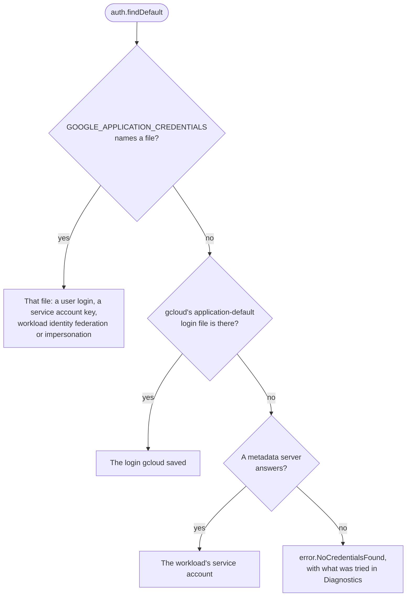

[Docs](README.md) › Credentials

# 🪪 Credentials

Production needs a `TokenProvider`, and the `auth` module makes one.
`auth.findDefault` picks it the way Google's own libraries do, so the
same binary runs on a laptop and on Cloud Run without a flag:

```zig
var arena: std.heap.ArenaAllocator = .init(gpa);
defer arena.deinit();
const lookup = try auth.Lookup.fromEnv(init.environ_map, arena.allocator());
var creds = try auth.findDefault(gpa, io, lookup, .{});
defer creds.deinit();
std.log.info("credentials from {t}", .{creds.source});

var client = try pubsub.Client.init(gpa, io, .{
    .project_id = "my-project",
    .token_provider = creds.provider(),
});
```

Every service module takes the same provider: `storage.Client` and
`secret_manager.Client` are made the same way.

`creds.provider()` also carries the project to charge for quota, which
user credentials name: the client sends it as `x-goog-user-project`, and
`send_quota_project` turns that off. When a call comes back 401, the
client drops the cached token, fetches another and tries once more.
`creds.projectId(io, arena)` says which project the program runs in,
when the credentials know: the metadata server does, and a service
account key file names the project it belongs to; a user login does not.
On Google Cloud that means a program needs no configuration at all.

**On this page:** [Where `findDefault` looks](#where-finddefault-looks) ·
[Choosing a source yourself](#choosing-a-source-yourself) ·
[Service account keys](#service-account-keys) ·
[Workload identity federation](#workload-identity-federation) ·
[Acting as a service account](#acting-as-a-service-account) ·
[A static token](#a-static-token) · [Signing](#signing)

## Where `findDefault` looks



It looks in three places, in this order:

1. The credentials file `GOOGLE_APPLICATION_CREDENTIALS` names: a user
   login (`authorized_user`), a service account key (`service_account`),
   workload identity federation (`external_account`), or a login that
   acts as a service account (`impersonated_service_account`).
2. The file `gcloud auth application-default login` writes, under
   `$HOME/.config/gcloud` or `%APPDATA%\gcloud`.
3. The metadata server, on Cloud Run, GKE, GCE or Cloud Functions, which
   hands out tokens for the workload's service account with nothing
   stored on disk.

The first place that has something decides it. A credential that is
there but unusable is an error, never a reason to try the next place:
running as somebody else, quietly, would be worse. With nothing
anywhere, the error is `NoCredentialsFound` and `Diagnostics` lists what
was tried.

## Choosing a source yourself

To choose a source yourself, use `auth.AuthorizedUser.initFromFile` for
a user login, `auth.ServiceAccount.initFromFile` for a key file,
`auth.ExternalAccount.initFromFile` for federation,
`auth.ImpersonatedServiceAccount.initFromFile` for impersonation, or
`auth.MetadataServer` on Google Cloud, whose `probe` answers whether
there is a metadata server to ask (in half a second on a machine that
has none) and whose `projectId` says which project it runs in. None of
them may move while a client uses its provider; the `Credentials` that
`findDefault` returns may, because it keeps the provider on the heap.

## Service account keys

A `ServiceAccount` signs a short-lived JWT with the key file's RSA key
(RS256, via `std.crypto`, checked against the key's own public half
before anything is sent) and trades it at the token endpoint. Its tokens
are minted for particular scopes, so the first `getToken` fixes them;
use a second provider for a second scope set.

## Workload identity federation

An `ExternalAccount` is workload identity federation: no stored Google
key at all. Each fetch reads the third-party subject token from the
file's credential source (a file, as GitHub Actions and Kubernetes
write, or a URL, as Azure's metadata service answers), trades it at
Google's STS, and, when the file names a service account to impersonate,
trades once more at the IAM Credentials API. Subject tokens rotate, so
each fetch reads anew. AWS credential sources (which need request
signing) and executable sources (which run a subprocess) are refused by
name. Scopes fix on first use, as for a service account.

## Acting as a service account

An `ImpersonatedServiceAccount` is a login that acts as a service
account, which Google recommends over key files for running locally as
one: nothing of the service account is stored, only the right to act as
it. It is the file this writes, which `findDefault` then picks up like
any other:

```sh
gcloud auth application-default login --impersonate-service-account=SA_EMAIL
```

Each fetch takes a token from the file's source credentials (a user
login, or a service account key) and trades it at the IAM Credentials
API for one that is the service account's. The source keeps its own
cached token, so most fetches cost one request. Only the account's email
is read from the file's URL: the request always goes to Google's
endpoint, as Google's own libraries do, so a crafted file cannot send
your token anywhere else. The login needs
`roles/iam.serviceAccountTokenCreator` on the service account, and a
refusal says so. Scopes fix on first use, as for a service account.

## A static token

A static token also works, for about an hour:

```zig
var token: pubsub.StaticToken = .{ .token = access_token }; // gcloud auth print-access-token
```

Emulator endpoints never receive a token, even when a provider is set,
and any other endpoint must use `https`.

## Signing

`creds.signer()` signs Cloud Storage's signed URLs and POST policies: on
this machine with a service account key, or through IAM for a login that
impersonates a service account and for a workload on Google Cloud. A
user's own login and workload identity federation cannot sign, and
`signer()` is null; `auth.IamSigner` names an account to sign as through
IAM instead. [Who can sign](storage/signed-urls.md#who-can-sign) has the
whole table, and what each needs.
