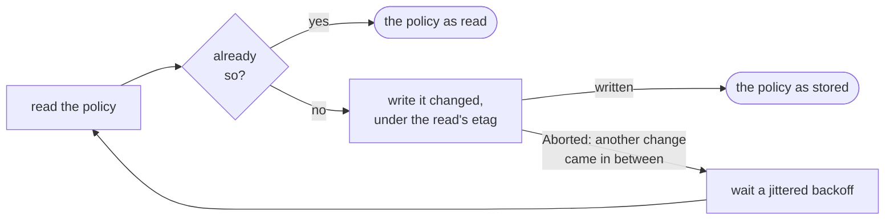

[Docs](README.md) › IAM

# IAM on every resource

Buckets, topics, subscriptions and secrets take the same five calls on
their IAM policy, on one shared policy type, so code that grants access
to one grants it to any:

| Call | What it does |
| --- | --- |
| `iamPolicy()` | The policy, asked for as version 3, conditions included |
| `setIamPolicy(policy)` | Writes the whole policy, and answers it as stored |
| `addIamBinding(role, member)` | Grants one member one role, unless the member already holds it |
| `removeIamBinding(role, member)` | Takes the member out of the role, unless it is not there |
| `testIamPermissions(permissions)` | The permissions the caller holds, of those asked |

```zig
// The project's Cloud Storage service agent may read one secret.
var service_agent = try gcs.serviceAgent();
defer service_agent.deinit();
const member = try std.fmt.allocPrint(arena, "serviceAccount:{s}", .{service_agent.value});
var policy = try secrets.secret("db-password").addIamBinding("roles/secretmanager.secretAccessor", member);
defer policy.deinit();
```

[`examples/iam.zig`](../examples/iam.zig) does all five on any of the
four from the command line:

```sh
zig build example-iam -- add gs://my-bucket roles/storage.objectViewer user:alice@example.com
zig build example-iam -- test projects/my-project/secrets/db secretmanager.versions.access
```

**On this page:** [Grant and revoke once](#grant-and-revoke-once) ·
[Members, as the services store them](#members-as-the-services-store-them) ·
[Building a policy](#building-a-policy) ·
[Where the services differ](#where-the-services-differ) ·
[Testing permissions](#testing-permissions) ·
[Errors and retries](#errors-and-retries)

## Grant and revoke once

`addIamBinding` and `removeIamBinding` read the policy, change the
role's binding that has no condition, and write the policy back under
the read's etag. When another change came in between, the write is
refused with `error.Aborted`, and they start over after a full-jitter
wait from the client's retry policy, up to its attempts, as IAM asks.
When the policy already says what they would make it say, nothing is
written, so either may be called again freely. Bindings with conditions
are kept as read and written back as they came. The answer is the
policy as it then is.



## Members, as the services store them

| Member | Means |
| --- | --- |
| `user:EMAIL`, `serviceAccount:EMAIL`, `group:EMAIL`, `domain:DOMAIN` | A Google account, a service account, a Google group, a Workspace domain |
| `allUsers`, `allAuthenticatedUsers` | Anyone, or anyone signed in |
| `principal://...`, `principalSet://...` | Workforce and workload identity federation, and sets such as a project's service accounts |
| `projectOwner:ID`, `projectEditor:ID`, `projectViewer:ID` | Buckets only: whoever holds that basic role on the project, named by its ID |
| `deleted:...` | IAM's record of a principal that was deleted: kept, written back as read, and revocable, never granted |

Every service lowercases the address of a `user:`, `serviceAccount:`,
`group:` or `domain:` member when it stores it, while the prefix stays
case-sensitive: `ServiceAccount:` is refused. So members compare that
way here (`core.iam.sameMember`), and granting `user:Alice@example.com`
to a policy that holds `user:alice@example.com` writes nothing. Every
service refuses a principal that does not exist.

## Building a policy

`setIamPolicy` takes a `core.iam.Policy`, which each service module
re-exports as `iam` (`pubsub.iam`, `storage.iam`, `secret_manager.iam`),
with the helpers that change one:

| | |
| --- | --- |
| `Policy.grants(role, member)` | Whether the member holds the role without a condition |
| `Policy.hasConditions()` | Whether any binding has a condition |
| `withMember(arena, policy, role, member)` | The policy with the member added, once |
| `withoutMember(arena, policy, role, member)` | The policy with the member taken out, an emptied binding dropped |

Pass a policy `iamPolicy` read, changed: its etag makes the write fail
with `error.Aborted` if the policy changed since, rather than undo that
change. A policy with no etag is written over whatever is there. A
written policy always carries its bindings, even none, and says version
3 whenever a binding has a condition, which every service requires.

## Where the services differ

| | Buckets | Topics and subscriptions | Secrets |
| --- | --- | --- | --- |
| Conditions | With uniform bucket-level access | Refused, before sending | Taken |
| Basic roles (`roles/viewer`) | Refused | Taken | Taken |
| `project*:` members | Taken, by the project's ID | Refused | Refused |
| The etag | The bucket's metageneration: any bucket update makes an older one stale | The policy's own | The policy's own |
| A concurrent change | 412, `error.Aborted` | 409, `error.Aborted` | 409, `error.Aborted` |
| OAuth scope | `Scope.full_control` or `.cloud_platform` | Pub/Sub's or cloud-platform | cloud-platform |
| Emulator | fake-gcs-server has no IAM: `error.NotFound` | 501, `error.Unimplemented` | None |

Guides: [buckets](storage/buckets.md#iam),
[topics and subscriptions](pubsub/topics-and-subscriptions.md#iam),
[secrets](secret-manager.md#iam).

## Testing permissions

`testIamPermissions` answers which of the permissions asked the caller
holds; it needs no permission of its own. Google meant it for
permission-aware tools, not for authorization checks: it "may fail
open". Refused before sending: none, over 100, one named twice, or a
wildcard.

| | Buckets | Topics and subscriptions | Secrets |
| --- | --- | --- | --- |
| At most | 84 | 100 | 100 |
| Which | Cloud Storage's own, not `storage.buckets.list` or `create` | Pub/Sub's own | Secret Manager's own |
| On a resource that does not exist | `error.NotFound` | `error.NotFound`, though Google's documentation says an empty answer | An empty answer: none held |

## Errors and retries

- **A concurrent change is `error.Aborted`** on every resource. Cloud
  Storage refuses it with the 412 `conditionNotMet` every failed
  precondition has, told apart by its message; its other two 412s on an
  IAM write, a condition without uniform access and `allUsers` under
  public access prevention, are `error.FailedPrecondition`, with Cloud
  Storage's words in `Diagnostics`.
- **Writes are retried only under an etag**, as Google's own libraries
  retry them: a retry then fails cleanly when the first attempt landed,
  as `error.Aborted`, which `addIamBinding` and `removeIamBinding`
  absorb by reading again. A bare `setIamPolicy` that reports
  `error.Aborted` after a transient failure may have landed: read the
  policy again. A write without an etag is sent once.
- **A role a resource does not take**, another service's or a basic role
  on a bucket, is `error.InvalidArgument` with the service's words: "Role
  roles/pubsub.publisher is not supported for this resource."
- **A workforce principal in a pool that does not exist** fails with a
  server error, 500 or 503, on every try, so it is retried like any
  transient failure before it fails.
- **Propagation.** A policy reads back changed at once. Access follows
  within seconds when measured for a service agent, and Google documents
  typically 2 minutes, potentially 7 or more.

<details>
<summary><b>📏 What was measured, on 2026-10-01</b></summary>

Four production runs on throwaway buckets, a topic, a subscription and
global and regional secrets, all deleted afterwards:

- A fresh topic, subscription or secret answers `{"etag": "ACAB"}`. Every
  write moves the etag, one that changes nothing included, and the
  answer to a write is what a read right after returns.
- Every service drops a binding with no members (its documentation says
  that is an error), stores a member named twice once, and merges two
  bindings of one role without a condition.
- An etag that is valid base64 but no etag is 400 "Invalid etag", never
  the mismatch; an empty etag is an unconditional write.
- Secret Manager keeps a secret's `auditConfigs` when a write leaves them
  out and sends no `updateMask`, which this library never sends.
- Read with no version, a policy with a condition answers version 1, the
  conditional role renamed `ROLE_withcond_HASH`; a secret's version 1
  view written back keeps its condition.
- At most 12 logical operators in a condition, and at most 20 bindings
  of one role and member with different conditions; a condition without
  a title is taken.
- Two clients granting on one topic at once both landed, each starting
  over when the other came in between.

</details>
