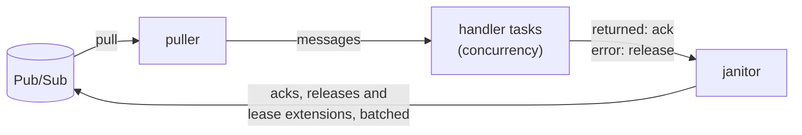

[Docs](../README.md) › [Pub/Sub](README.md) › Subscribing

# Subscribing

**On this page:** [A worker loop](#a-worker-loop) ·
[Exactly-once delivery](#exactly-once-delivery)

## A worker loop

Consuming a subscription for real means more than `pull` and `ack`:
leases must be extended while a handler runs, failures released for
redelivery, work bounded, and shutdown clean. `Subscriber` is that loop:

```zig
const Printer = struct {
    fn handler(self: *Printer) pubsub.Subscriber.Handler {
        return .{ .ptr = self, .vtable = &.{ .handle = handle } };
    }
    fn handle(ptr: *anyopaque, io: std.Io, message: pubsub.ReceivedMessage) anyerror!void {
        std.debug.print("{s}\n", .{message.data}); // return acks; an error releases
        _ = .{ ptr, io };
    }
};

var subscriber = try pubsub.Subscriber.init(gpa, io, .{
    .subscription_id = "orders-worker",
    .client = .{ .project_id = "my-project", .token_provider = creds.provider() },
    .concurrency = 4,
});
defer subscriber.deinit();
try subscriber.run(printer.handler()); // until subscriber.stop(), or a fatal error
```



`run` blocks and runs everything else on tasks of its own: one puller,
one janitor that batches acknowledgements, releases and lease
extensions, and `concurrency` handler tasks. A handler returning
acknowledges its message; an error releases it for redelivery, so
delivery is at least once and a handler must tolerate a duplicate.
Leases are extended for as long as a handler runs, up to
`max_extension_s`, after which the handler is presumed dead and the
server redelivers elsewhere. `max_outstanding` bounds how many
unresolved messages are held at once, and pulling pauses at the cap.

Transient failures anywhere are retried forever, further and further
apart; an error retrying cannot fix, such as the subscription being
deleted, stops the loop and comes back from `run` with the diagnostics
filled. A refusal that concerns single messages never stops it: an
acknowledgement the server refuses is counted, and its message may come
again, which at-least-once delivery allows. `stop` is safe to call from
a handler or another task: pulling stops, running handlers finish and
their messages resolve, buffered ones are released unhandled, and the
last acknowledgements are flushed. Acknowledgements go out within 100 ms
of a handler returning, batched.

`stats()` is a consistent snapshot of the counters at any time. `acked`
counts acknowledgements the server took, and `ack_failed` the ones it
refused or that were given up; once `run` has returned after `stop`,
every message received is counted exactly once among `acked`,
`ack_failed`, `nacked` and `receipt_refused`.

> [!NOTE]
> `run` reads the subscription first, for its ack deadline, which needs
> `pubsub.subscriptions.get`. `roles/pubsub.subscriber` does not grant
> it: with only that role, the read is refused, and `run` logs a warning
> and extends leases by 60 s instead. Setting `extension_period_s` skips
> the read.

[`examples/worker.zig`](../../examples/worker.zig) runs a `Subscriber`:
`zig build example-worker -- orders orders-worker`.

## Exactly-once delivery

A subscription created with `.enable_exactly_once_delivery = true` never
delivers again a message acknowledged within its lease, and refuses,
rather than takes, an acknowledgement or lease extension that comes
after the lease lapsed.

> [!TIP]
> Leave `ack_deadline_seconds` at 0 for such a subscription: Pub/Sub
> then gives it 60 s.

`Subscriber` handles it as Google's own clients do. It extends leases by
at least 60 s. It extends each pulled message's lease once before a
handler sees it, and drops, unhandled, any message whose lease the
server refuses there (`stats().receipt_refused`): its ack could never be
taken, and the server delivers it again. An ack refused for good is
counted in `ack_failed`; one refused only for now is sent again, backing
off from 1 s to 64 s, for up to 10 minutes. It learns that a
subscription has exactly-once delivery from reading it, or, when it may
not, from the first refusal that says so.

With `pull`, `ackWithResults` says what became of each id:

```zig
var results: [2]pubsub.AckResult = undefined;
try worker.ackWithResults(&.{ late.ack_id, fresh.ack_id }, &results);
// results: .{ .invalid_ack_id, .ok }: the late one was refused, the other taken.
```

An `AckResult` is `.ok`, `.invalid_ack_id` (refused for good: the lease
had lapsed, or the message was already acknowledged), `.transient`
(still refused for now after the client's retries) or `.other`.
Measured in production: when a request carries a lapsed id and a live
one, the server refuses the request, names only the lapsed id, and takes
the live one. `ack` fails with `error.InvalidArgument` when any id was
refused, after sending every id, and `Diagnostics` counts them.

Google's guarantee holds only when subscribers connect to the service in
the same region, and it asks for streaming pull, which this client does
not have, where throughput must be high.
