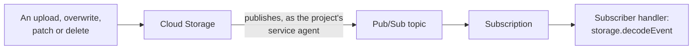

[Docs](../README.md) › [Cloud Storage](README.md) › Notifications

# Notifications

Cloud Storage can publish a Pub/Sub message for every change to a
bucket's objects: the way a program learns that a file arrived.
`createNotification` sets it up, and `storage.decodeEvent` reads each
message a `pubsub.Subscriber` receives into an `ObjectEvent`.



```zig
// The project's Cloud Storage service agent publishes, so it needs the
// publisher role on the topic.
var agent = try gcs.serviceAgent();
defer agent.deinit();
const member = try arena.print("serviceAccount:{s}", .{agent.value});
var policy = try ps.topic("uploads").addIamBinding("roles/pubsub.publisher", member);
policy.deinit();

var config = try gcs.bucket("my-bucket").createNotification(.{
    .topic = .{ .project = "my-project", .topic = "uploads" },
    .events = &.{ .finalize, .delete },
    .object_name_prefix = "incoming/",
});
defer config.deinit();

// In a Subscriber's handler, with `message` as it receives it:
var event = try storage.decodeEvent(gpa, message, .{});
defer event.deinit();
switch (event.value.kind) {
    .finalize => process(event.value.bucket, event.value.object, event.value.generation),
    else => {},
}
```

- **The grant.** Without the publisher role, or without the topic,
  `createNotification` is `error.TopicNotPublishable`. A fresh grant
  took a few seconds to apply when measured.
  [IAM](../pubsub/topics-and-subscriptions.md#iam) says how
  `addIamBinding` grants it.
- **A create is safe to retry.** A repeated create makes a second
  configuration, idempotency token or not, so the bucket's
  configurations are listed first, and a create whose answer was lost is
  found among them afterwards rather than sent again.
- **Checked before sending**, with `error.InvalidNotificationConfig`: a
  topic Pub/Sub would not name; an empty, repeated or unknown event
  type, since Cloud Storage drops one it does not know and then
  publishes every type; more than 5 custom attributes (its documentation
  says 10); keys over 256 bytes and values over 1,024 (its refusals say
  characters, and count bytes); a custom attribute named like one Cloud
  Storage sets, which it takes and then overrides on every message; and
  one beginning with `goog` in any case, which it takes, and then
  delivers none of the configuration's messages.
- **Limits.** A bucket takes 100 configurations, and 10 that publish any
  one event type, Eventarc and Cloud Run triggers on the bucket
  included: the eleventh is `error.InvalidArgument`.

> [!IMPORTANT]
> **At least once, twice over.** Cloud Storage publishes at least once,
> and Pub/Sub delivers at least once, each repeat under a new message
> ID: `ObjectEvent.key` names the change, so a handler can tell a
> repeat. Repeats are not rare: while one configuration's messages could
> not be published, another on the same bucket received each event 8
> times over two and a half minutes. Order is not kept: act on an object
> with its generation as a precondition.

[`examples/gcs_notify.zig`](../../examples/gcs_notify.zig) sets a bucket
up and watches its changes:

```sh
zig build example-gcs_notify -- setup my-bucket my-project uploads --prefix incoming/
zig build example-gcs_notify -- watch my-project uploads-watch
```

## What each change publishes

Measured against Cloud Storage on 2026-10-01:

| What happened | Events |
| --- | --- |
| An upload of any kind, a compose, a copy, a restore | `finalize` |
| An overwrite | `finalize` of the new generation with `overwrote_generation`, and `delete` of the old one (`archive` with versioning) with `overwritten_by_generation` |
| A delete, soft delete on or off | `delete`, at once |
| A delete of the live version, with versioning | `archive` |
| A move | `delete` of the source, `finalize` of the destination |
| Any metadata patch, holds included, even one that changes nothing | `metadata_update` |
| An upload refused by a condition, an aborted multipart upload | nothing |

- A JSON payload is the object's metadata without its ACLs, after the
  change, or as it was before a delete. A plain delete's carries no
  `timeDeleted`, whatever the documentation says: only an archived or
  noncurrent version's does. `NONE` sends no payload at all.
- A prefix is a case-sensitive byte prefix.
- A configuration delivered within 8 seconds of its creation, and
  stopped at once when deleted.
- A parallel upload with conditions finishes under a temporary name,
  `zig-gcp-tmp/...`, and moves into place: its events include that
  object's `finalize` and `delete`. A configuration with a prefix leaves
  them out.

fake-gcs-server keeps configurations and publishes their messages too,
with differences [The emulator](emulator.md) lists.
